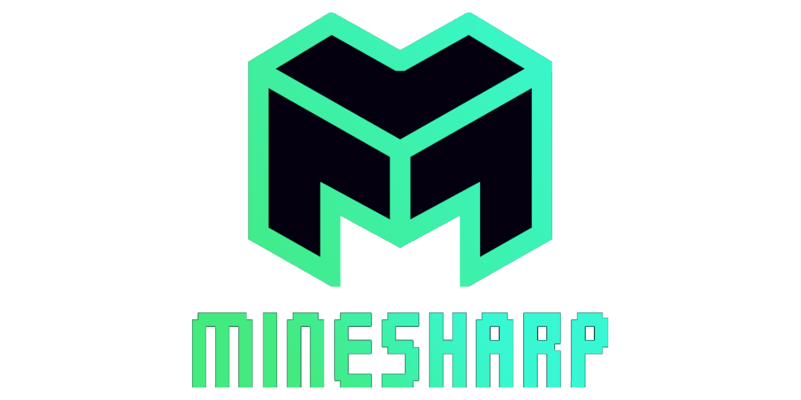

# MineSharp

[](https://gitter.im/MineSharp-net/community?utm_source=badge&utm_medium=badge&utm_campaign=pr-badge)
[](https://discord.gg/Pt6JT5nXMr)
[](https://github.com/psu-de/MineSharp/blob/main/LICENSE)

**This Project is not finished and under development!**

Create Minecraft bots with C#! \
Inspired by [Mineflayer](https://github.com/PrismarineJS/mineflayer).

If you're interested in this project, feel free to contribute!

Minecraft Java 1.18 - 1.20.1 supported 

# Current features

- ✨Supported Versions: 1.18.x - 1.20.1
- 📈 Player Stats
- ⚡ Events
- 🐖 Entity tracking
- 🌍 World tracking (query the world for blocks)
- ⛏️ Mining (very simple, needs some more work)
- 👷‍♂️ Building (very simple, needs some more work)
- ~~🛠️ Crafting~~
- 🪟 High-Level window Api
- ⚔️ Attacking entities
- ~~🏃 Movements (Walking, Sprinting, Jumping, Sneaking)~~
- ~~🔎 Simple Pathfinder~~
- 📝 Chat (Reading and Writing)

# Roadmap

- All crossed things will be supported soon!

# Example
```csharp
using MineSharp.Bot;
using MineSharp.Bot.Plugins;

MinecraftBot bot = await MinecraftBot.CreateBot(
    "MineSharpBot",
    "127.0.0.1",
    25565,
    offline: true);

var chat = bot.GetPlugin<ChatPlugin>();

if (!await bot.Connect()) 
{
    Console.WriteLine("Could not connect to server!");
    Environment.Exit(1);
}

while (true)
{
    var input = Console.ReadLine();
    if (input == "exit") 
    {
        await bot.Disconnect();
        break;
    }
    
    if (input != null)
        await chat.SendChat(input);
}

```

# Projects Overview

### [MineSharp.Core](../MineSharp.Core)

Contains core functionality and common Minecraft types like Entity, Block, etc...

### [MineSharp.Data](../MineSharp.Data)
MineSharp.Data is a wrapper for [minecraft-data](https://github.com/PrismarineJS/minecraft-data).
Currently the following data is supported:
 - Biomes
 - Blocks
 - Collisions
 - Effects
 - Enchantments
 - Entities
 - Features
 - Items
 - Language
 - Protocol (Packet id's and names)
 - Recipes

### [MineSharp.Bot](../MineSharp.Bot)

API to directly interact with a minecraft server. \
See [MineSharp.Bot README](../MineSharp.Bot)

## Components

### [MineSharp.Auth](../Components/MineSharp.Auth)

Used to login to Microsoft, connect to Mojang Auth servers and create a Minecraft Session.

### [MineSharp.Physics](../Components/MineSharp.Physics)

Logic to simulate entity physics from minecraft\
Thanks to [ConcreteMC/Alex](https://github.com/ConcreteMC/Alex)

### [MineSharp.Protocol](../Components/MineSharp.Protocol)

Implements the Minecraft Protocol. Contains logic to connect to a Minecraft server and read/write packets from/to it.

### [MineSharp.World](../Components/MineSharp.World)

Basic functionality to represent a Minecraft World and interact with it.

### Links
Without the following resources this project would not be possible. Thanks to all people involved in those projects!

- [wiki.vg](https://wiki.vg)
- [Minecraft-Console-Client](https://github.com/MCCTeam/Minecraft-Console-Client)
- [mineflayer](https://github.com/PrismarineJS/mineflayer)
- [Alex](https://github.com/ConcreteMC/Alex)
